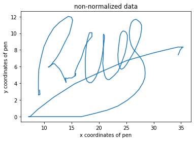
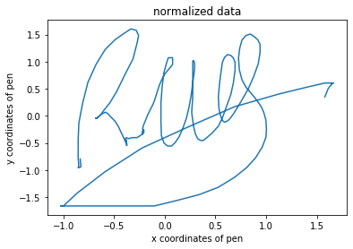
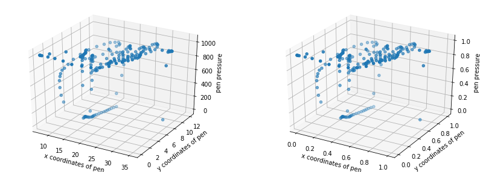
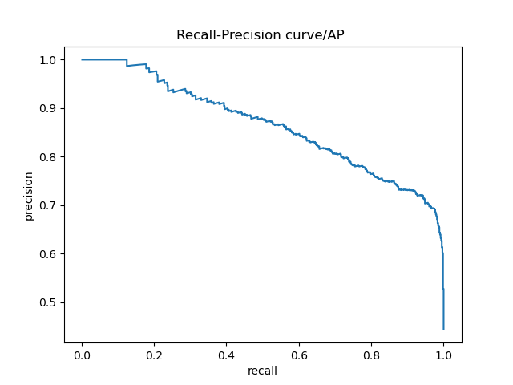

# Signature Verification

## ATTENTION
During our final testing stages we noticed that data generation does not work on every computer, we were unable to trace back this bug in our code or our project files, so we assume that it has something to do with a Python, or Python-Library version mismatch.
If you run or code with the Variable: "recompute_data" = True, and the Precision/Recall plot looks different from the one in this Report; please unzip the file: ./tools/pickle/original_pickles.zip, and change "recompute_data" back to False.

## Feature selection and scaling
Here we can see two features of a signature, the x and y position of the pen at a given time point (the time dimension is flattened in the plot). We can see the effect of `RobustScaler` by the `sklearn` library. 




Adding a third feature, `pressure` we can see the necessity; pressure has a much wider range (0-1000) than the two position features (0-35), and would dominate any function calculating the distance between two signatures, dwarfing any distances calculated on the two positional features. This time using `MinMaxScaler`, which is less robust to outliers, but allows us to restrict the output to a fixed range of values (0-1).


When fitting the normalization function to each signature individually, we loose the absolute differences between two signatures. Example: Person A pressed the pen consistently but really hard when signing, person B impersonating person A also presses the pen consistently but softer - we cannot differentiate these two if we normalize them individually, even tough this would be a good discriminator. Instead we need to fit the scaler to the whole train set, and only then apply to each individual signature. When testing, we need to use the scaler fitted on the training data to normalize it. In other other words: If we normalize and fit the scaler to each signature individually, we only keep the realtive differences inside the signatures, and loose the absolute differences between the signatures.

As features we selected:
```
[:,0] =  position x
[:,1] =  position y
[:,2] =  speed v(x)
[:,3] =  speed v(y) 
[:,4] =  pressure
```
## Dynamic Time Warping
To determine how similar the test-signatures from the validation set are to the 5 corresponding signatures in the enrollment set, we calculated the distances between each of them using the fastdtw package. I.e. we obtained 5 distances per signature in the validation set, from which we only kept the minimal. As signatures from different people vary with different strength, we normalized these distances using the mean and std of the distances of the corresponding ground truth signatures in the enrollment set: 

(xi-mean)/std 

Note that this will yield a negative value if the min distance between the test-signature and the enrollment set signature is smaller than the mean distance within the 5 signatures in the enrollment set. 
The obtained distances were stored in a list ("distance list"), the corresponding image name was stored in another list ("name list"), and whether this image showed an original (g) or a forgery (f) again in another list ("ground truth list"). Those lists were then sorted in exactly the same way, namly such that the obtained distances are ordered from smallest to largest. 

## Evaluation
The ground truth list was iterated over; in each iteration, one additional image was considered as a hit. We calculated the recall and the precision values for each iteration and saved them in 2 separate lists: 
recall= TP/(TP+FN)
precision= TP/(TP+FP)
Those lists were then used to plot the precision recall curve: 



The last index at which the precision value was maximal (i.e. =1) +1 told us, how many true positives were found until the first false negative occured. The corresponding distance threshold was extracted from the distance list. 
Similarly, the first index at which the recall value was maximal (i.e. =1) +1 told us, how many images had to be considered to find all true positives. The corresponding distance threshold was extracted from the distance list. 
The following was printed by our code:

In total, there are 1350 distances (signatures)
max precision is achieved until the 75 smallest distances ,i.e. until a distance of -1.1902129296417159 standard deviations
max recall is achieved using the 1137 smallest distances, i.e. until a distance of 5.039719219228603 standard deviations

Note, that the max precision is only achieved until a negative value for the number of std: this means, that the signatures from the validation set are not allowed to vary as much from the train signatures than the train signatures vary among each other. I.e. there seems to be at least 1 very good forgery in the validation data set. 

Deciding on the distance threshold [std] depends very much on how bad not recognizing a forgery would be. E.g. to get money from a bank, it is important to ensure a very high precision. It is not so bad if some of the true signatures are recognized as forgeries. However, if e.g. our algorithm should check whether a child imitated the signature of its parents, we would choose a very high recall value instead, as we would not want to wrongly accuse the child of forgery. In this case, it would not be so bad if some forgeries are not recognized as such. 

